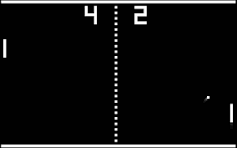

# 🚀 Description

This is a group project about creating a single page web application platform to play the famous Pong game.

 

# 🧠 Contributors

[Blaze Kalonda](https://github.com/blaisek) 
&emsp;42intra profile : [btchiman](https://profile.intra.42.fr/users/btchiman)  
 
[Jules Laurent](https://github.com/porgito) 
&emsp;42intra profile : [jlaurent](https://profile.intra.42.fr/users/jlaurent)  
 
[Enkhbaatar Turbat](https://github.com/eturbat4312) 
&emsp;42intra profile : [eturbat](https://profile.intra.42.fr/users/eturbat) 

## Mandatory part

- **Overview**

Thanks to your website, users will play Pong with others. You have to provide a nice user interface and real-time multiplayer online games !
- *Your project needs to adhere to the following guidelines as a minimum requirement, contributing only a small portion to the final grade.*
- *The second part of this subject will offer additional modules that can replace or complete the following rules.*

- **Minimal technical requirement**

Your project has to comply with the following rules:

You are free to develop the site, with or without a backend.
- *If you choose to include a backend, it must be written in pure Ruby . However,
this requirement can be overridden by the Framework module.*
- *If your backend or framework uses a database, you must follow the constraints
of the Database module.*
- *The frontend should be developed using pure vanilla Javascript . However, this
requirement can be altered through the FrontEnd module.*
- *Your website must be a single-page application. The user should be able to use the
Back and Forward buttons of the browser.*
- *Your website must be compatible with the latest stable up-to-date version of
Google Chrome.*
- *The user should encounter no unhandled errors and no warnings when browsing the
website.*
- *Everything must be launched with a single command line to run an autonomous
container provided by Docker . Example : docker-compose up --build*

- **Game**

The main purpose of this website is to play Pong versus other players.
- *Therefore, users must have the ability to participate in a live Pong game against another player directly on the website. Both players will use the same keyboard. The Remote players module can enhance this functionality with remote players.*
- *A player must be able to play against another player, but it should also be possible to propose a tournament. This tournament will consist of multiple players who can take turns playing against each other. You have flexibility in how you implement the tournament, but it must clearly display who is playing against whom and the order of the players.*
- *A registration system is required: at the start of a tournament, each player must input their alias name. The aliases will be reset when a new tournament begins. However, this requirement can be modified using the Standard User Management module.*
- *There must be a matchmaking system: the tournament system organize the matchmaking of the participants, and announce the next fight.*
- *All players must adhere to the same rules, which includes having identical paddle speed. This requirement also applies when using AI; the AI must exhibit the same speed as a regular player.*
- *The game itself must be developed in accordance with the default frontend constraints (as outlined above), or you may choose to utilize the FrontEnd module, or you have the option to override it with the Graphics module. While the visual aesthetics can vary, it must still capture the essence of the original Pong (1972).*

- **Security concerns**

In order to create a basic functional website, here are a few security concerns that you have to tackle:
- *Any password stored in your database, if applicable, must be hashed.*
- *Your website must be protected against SQL injections/XSS.*
- *If you have a backend or any other features, it is mandatory to enable an HTTPS connection for all aspects (Utilize wss instead of ws...).*
- *You must implement some form of validation for forms and any user input, either within the base page if no backend is used or on the server side if a backend is employed.*

## Modules

16 Major module

11 Minor module

- **Web**
    - *Major module*: Use a framework as backend :x:
    - *Minor module*: Use a front-end framework or toolkit :x:
    - *Minor module*: Use a database for the backend :x:
    - *Major module*: Store the score of a tournament in the Blockchain :x:
- **User Management**
    - *Major module*: Standard user management, authentication, users across tournaments :x:
    - *Major module*: Implementing a remote authentication :x:
- **Gameplay and User Experience**
    - *Major module*: Remote players :x:
    - *Major module*: Multiplayer (more than 2) :x:
    - *Major module*: Add Another Game with User History and Matchmaking :x:
    - *Minor module*: Game customization options :x:
    - *Major module*: Live chat :x:
- **AI-Algo**
    - *Major module*: Introduce an AI opponent :x:
    - *Minor module*: User and game stats dashboard :x:
- **Cybersecurity**
    - *Major module*: Implement WAF/ModSecurity with Hardened Configuration and HashiCorp Vault for Secrets Management :x:
    - *Minor module*: GDPR Compliance Options with User Anonymization, Local Data Management, and Account Deletion :x:
    - *Major module*: Implement Two-Factor Authentication (2FA) and JWT :x:
- **Devops**
    - *Major module*: Infrastructure Setup for Log Management :x:
    - *Minor module*: Monitoring system :x:
    - *Major module*: Designing the Backend as Microservices :x:
- **Graphics**
    - *Major module*: Use advanced 3D techniques :x:
- **Accessibility**
    - *Minor module*: Support on all devices :x:
    - *Minor module*: Expanding browser compatibility :x:
    - *Minor module*: Multiple language support :x:
    - *Minor module*: Add accessibility for visually impaired users :x:
    - *Minor module*: Server-side rendering (SSR) integration :x:
- **Object Oriented**
    - *Major module*: Replacing Basic Pong with Server-Side Pong and Implementing an API :x:
    - *Major module*: Enabling Pong Gameplay via CLI against Web Users with API Integration :x: